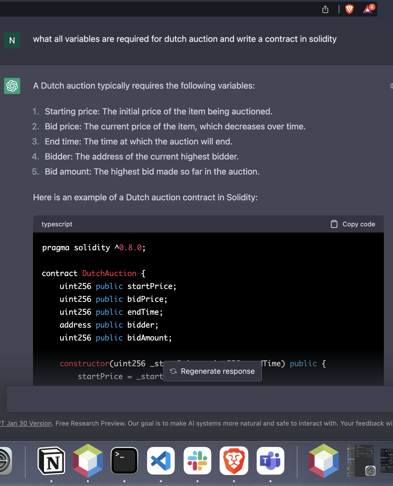
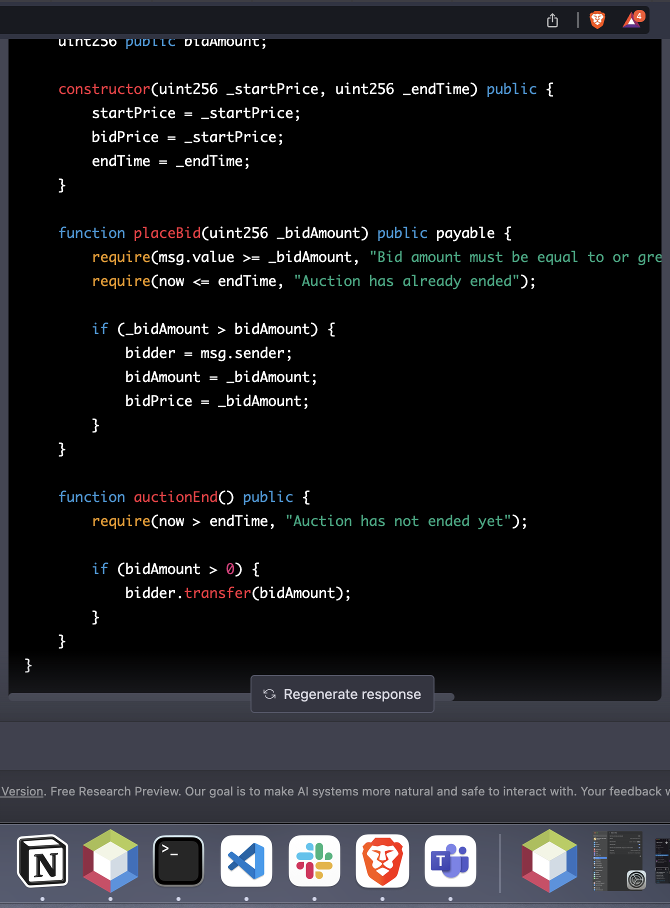

# Name: Narasimha Teja Reddy

# NUID: 002793709

# Basic Dutch Auction
This is a Solidity contract for a basic Dutch auction, where the auction price starts high and gradually decreases over time until a bidder submits a bid at or above the current price, winning the auction.

# Contract Parameters
The contract is initialized with the following parameters:
reservePrice: The minimum amount of wei that the seller is willing to accept for the item.
numBlocksAuctionOpen: The number of blockchain blocks that the auction is open for.
offerPriceDecrement: The amount of wei that the auction price should decrease by during each subsequent block.

# Contract Functions
The contract has the following functions:
decrementPrice(): Decreases the price of the item based on the elapsed time and offerPriceDecrement.
endAuction(): Returns the end time of the auction.
bid(): Allows a bidder to submit a bid at the current price. The first bid processed by the contract that sends wei greater than or equal to the current price wins the auction.

# Testing the Contract
The test cases for the contract are written in TypeScript and use the Hardhat framework for testing. To run the tests, you need to have Hardhat installed.
npm install -g hardhat

To run the tests, simply run the following command:
hardhat test

This will compile the contract and run the tests, generating a coverage report to ensure that the contract and its functions are thoroughly tested.

# AI code usage:

